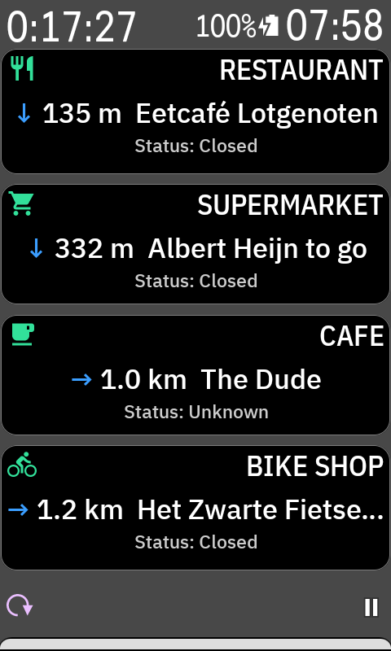

# Pitstop

An extension for the Hammerhead Karoo that surfaces the **nearest open service** along a planned route, and routes you there in two taps via the Karoo's built-in navigation. Pick any combination of ten categories — **restaurant, supermarket, fuel, cafe, hotel, doctor, pharmacy, bike shop, ATM, train station** — and add each as its own data tile on a ride profile page.

Repository: [github.com/rutgerg/karoo-pitstop](https://github.com/rutgerg/karoo-pitstop)

[](https://github.com/rutgerg/karoo-pitstop/releases/latest)
[](https://github.com/rutgerg/karoo-pitstop/actions/workflows/release.yml)
[](LICENSE)

<p align="center">
  
</p>

## Why Pitstop

Long rides need food, water, fuel, sometimes a cash machine — and the rider does not want to fumble with a phone in a jersey pocket while moving. The Karoo handles the route, but not the question every cyclist has on hour four:

- **What is open near me right now, along my route?** Stock Karoo navigation routes you, but does not surface live services.
- **Komoot and RideWithGPS POIs are pre-trip planning artefacts.** They show what *exists*, not what is *currently open* — and they sit on a phone you cannot see while pedalling.
- **The bar-mounted screen is the right interaction surface mid-ride.** A glance at a data tile beats fishing out gloved-hand-unfriendly hardware.

## Use cases

Pitstop is built for situations where the route is set but the next stop is undecided:

- **Brevet / audax** — find the next open supermarket between controls without stopping to phone-check.
- **Remote gravel** — locate a fuel station with a shop for water and snacks, often the only thing open for kilometres.
- **Bonk recovery** — when you are crashing, the data tile shows the nearest open food source by distance, no menu diving.
- **Unfamiliar territory** — the Karoo already has the route; let the device tell you which services line it.

## Status

- **`:app`** — Android module. Ten per-category data field tiles (Restaurant, Supermarket, Fuel, Cafe, Hotel, Doctor, Pharmacy, Bike Shop, ATM, Train Station) registered as `KarooExtension` data types render on a ride profile page. Tap a tile to dispatch `LaunchPinDrop` and open the Karoo's pin activity. Verified end-to-end on a Karoo.
- **`:data`** — Headless Kotlin/JVM module: Overpass POI fetcher, opening-hours evaluator, polyline decoder, SQLite cache. Runnable on a Mac via `./gradlew :data:run`. JUnit tests cover slicer, opening-hours, polyline. App-level tests cover `KarooClient.navigateTo`, `RouteWatcher` (including Wi-Fi-triggered retry), `PeriodicRefresh`, the tile view-decision logic, and the `FetchDiary` ring buffer.

## How it works

1. You plan a route on the Karoo's native navigator.
2. `RouteWatcher` (Application-scoped) sees the route appear, samples the polyline every 2 km, queries Overpass with a 10 km buffer, and upserts ~thousands of POIs into local SQLite. Dedups on a `route_fetches` table so the same route isn't re-fetched. If Wi-Fi isn't available at route load, the fetch retries automatically as soon as the Karoo associates with an internet-capable network — no need to re-pick the route.
3. `PeriodicRefresh` wakes every 20 minutes and re-queries a 10 km radius around the rider's latest known location, keeping the cache warm on off-route detours and multi-day rides. Fails silently when offline; succeeds whenever Wi-Fi is reachable.
4. Ten data field tiles (Restaurant, Supermarket, Fuel, Cafe, Hotel, Doctor, Pharmacy, Bike Shop, ATM, Train Station) on your ride profile page render the nearest non-closed POI per category, with distance, name, and the OSM `opening_hours` line. Closed entries are filtered out; Open and Unknown are both shown. While a fetch is pending recovery the tile shows **Waiting for Wi-Fi…**.
5. Tap a tile → `LaunchPinDrop(Symbol.POI(...))` opens the Karoo's pin Activity → tap **Navigate** (replaces the active route) or **Save as POI** (bookmarks for later — no route change).

## Install

1. Download `pitstop.apk` from the [latest release](https://github.com/rutgerg/karoo-pitstop/releases/latest).
2. Enable USB debugging on the Karoo: Settings → System → About → tap build number 7× → enable USB debugging in Developer options.
3. Sideload over USB:

   ```bash
   adb install pitstop.apk
   ```

   If the install fails with `INSTALL_FAILED_UPDATE_INCOMPATIBLE`, you have a pre-v1.2.0 build installed with the old signing key. Uninstall it once (`adb uninstall dev.karoorestaurant`) and re-run the install. Subsequent updates will work in place.

4. Reboot the Karoo. The App Store binds the extension as **Pitstop** and the ten data types appear in the Karoo Pages data-type picker. Add any combination of **Restaurant**, **Supermarket**, **Fuel**, **Cafe**, **Hotel**, **Doctor**, **Pharmacy**, **Bike Shop**, **ATM**, and **Train Station** tiles to a ride profile page; that page is the on-device entry point. There is no app-drawer icon — see [Karoo platform notes](docs/karoo-platform-notes.md) for why.

## Build from source

Only needed to modify Pitstop or run it on the Pixel emulator. End users should install the prebuilt APK above.

### Prerequisites

- Android Studio Koala (or newer) — manages the JDK, gradle wrapper, AGP.
- A GitHub Personal Access Token with the `read:packages` scope. The `karoo-ext` SDK is published only to GitHub Packages, which **requires authentication even for public reads**.

### Setup

1. Create a PAT at github.com/settings/tokens → **Generate new token (classic)** → scope **`read:packages`** only.
2. Add credentials to `~/.gradle/gradle.properties` (NOT to the repo):

   ```properties
   gpr.user=YOUR_GITHUB_USERNAME
   gpr.key=ghp_xxxxxxxxxxxxxxxxxxxx
   ```

   Or export `GITHUB_USERNAME` / `GITHUB_TOKEN` in your shell.
3. Open the project folder in Android Studio. Let it sync gradle. First sync downloads `karoo-ext` from GitHub Packages — if it 401s, your PAT is wrong or missing the `read:packages` scope.
4. (Optional, recommended) Install the gitleaks pre-commit hook so staged changes are scanned for secrets before every commit:

   ```bash
   brew install pre-commit gitleaks
   pre-commit install
   ```

   Config lives in `.pre-commit-config.yaml` at the repo root.

### Build & sideload

```bash
./gradlew :app:assembleDebug
adb install -r app/build/outputs/apk/debug/app-debug.apk
```

For a quicker turnaround during development, run from Studio: select the **app** run config, plug in the Karoo, click ▶︎.

## Run on the Pixel emulator

The app installs and launches on a stock Pixel 7 emulator. Without a Karoo OS the SDK can't bind, so the data tiles never receive route/location events — but the launcher Activity (`MainActivity`) is the Settings screen, which renders without needing the Karoo SDK. Useful for verifying Settings renders cleanly and the telemetry toggle persists; not useful for the live tile cycle.

## Run the data prototype (no Karoo needed)

```bash
./gradlew :data:run
```

Resamples a hard-coded Amsterdam → Haarlem → IJmuiden loop, fetches POIs from Overpass, persists to `pois.sqlite`, prints per-category counts, the nearest non-closed pick per category, and the `opening_hours` coverage rate. The same data layer is wired into `:app` via the `Polyline`, `OverpassClient`, and `OpeningHours` types.

CLI flags (all optional):

- `--db=path.sqlite` — DB file, default `pois.sqlite`
- `--step=2000` — resampling step in metres
- `--radius=10000` — Overpass `around:` radius in metres
- `--refetch` — force a fresh fetch even if the DB is non-empty

Tests: `./gradlew :data:test`.

## Privacy

Pitstop sends a small amount of anonymous usage data on each ride day so the maintainer (one person, this side project) can tell whether anyone is actually using the app and how often. **This is on by default. To turn it off, go to Settings → Telemetry.**

Full data-handling statement — what is sent, what is not, where it goes, and retention — in [`docs/privacy.md`](docs/privacy.md).

## Documentation

- [Contributing](CONTRIBUTING.md) — how to report bugs, propose features, and submit code changes
- [Project shape](docs/project-shape.md) — module layout and file-by-file role description
- [Privacy](docs/privacy.md) — anonymous telemetry contract: what is sent, what is not, where it goes, how to opt out
- [Releasing](docs/releasing.md) — maintainer-only workflow and release checklist
- [Troubleshooting](docs/troubleshooting.md) — common errors and fixes (auth, GPS, fetch failures, gradle cache)
- [Karoo platform notes](docs/karoo-platform-notes.md) — non-obvious karoo-ext gotchas useful when forking or building your own extension

## What's next

See the [issue tracker](https://github.com/rutgerg/karoo-pitstop/issues) for open features and bugs.

Hit a bug or have a feature request? [Open an issue](https://github.com/rutgerg/karoo-pitstop/issues/new) — contributions and reports are welcome.

## License

Released under the [MIT License](LICENSE) — © 2026 Rutger Geelen. Free to use, fork, and modify with attribution.
